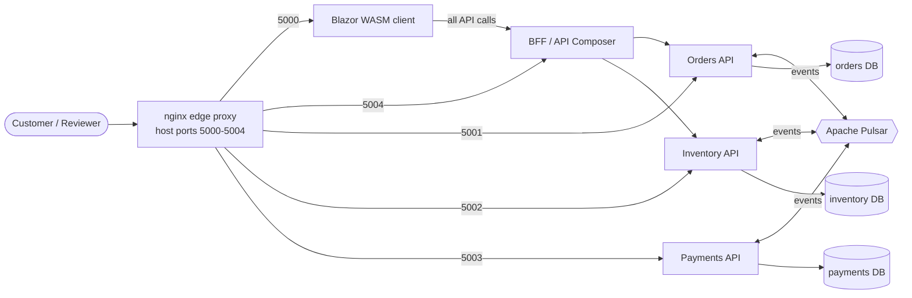
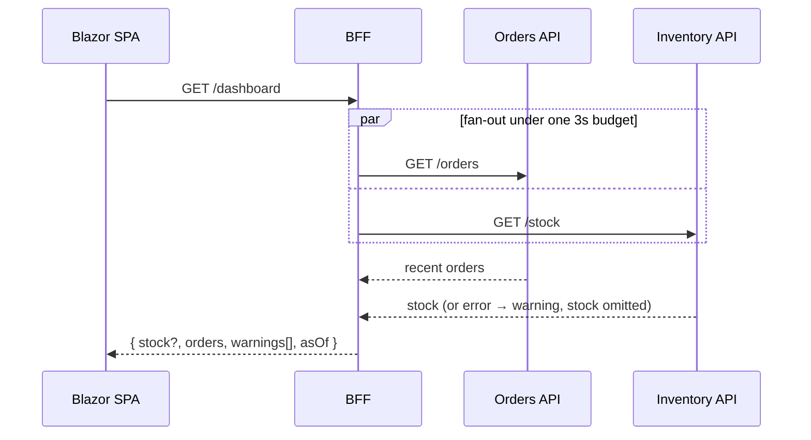
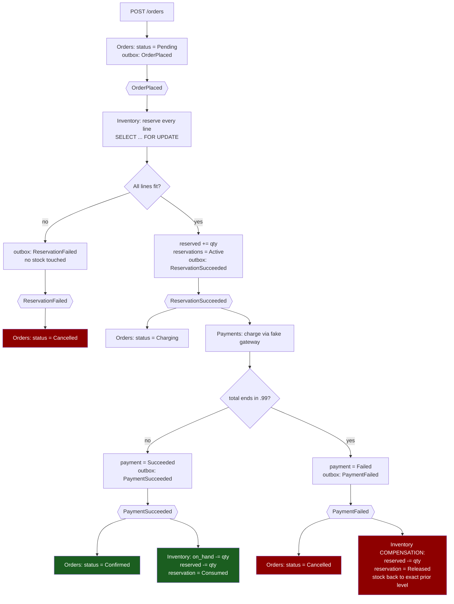
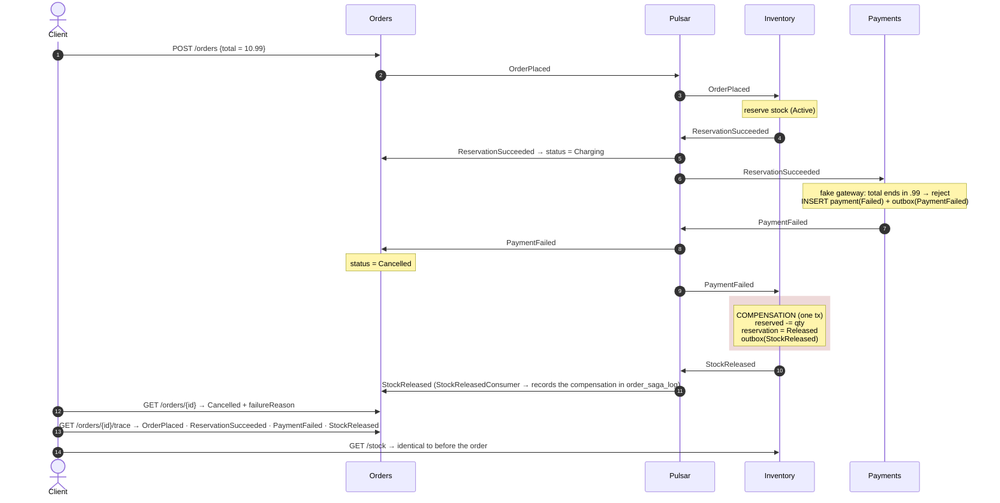
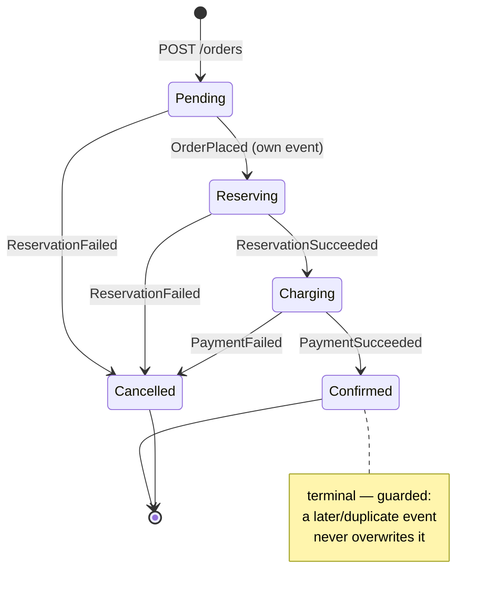
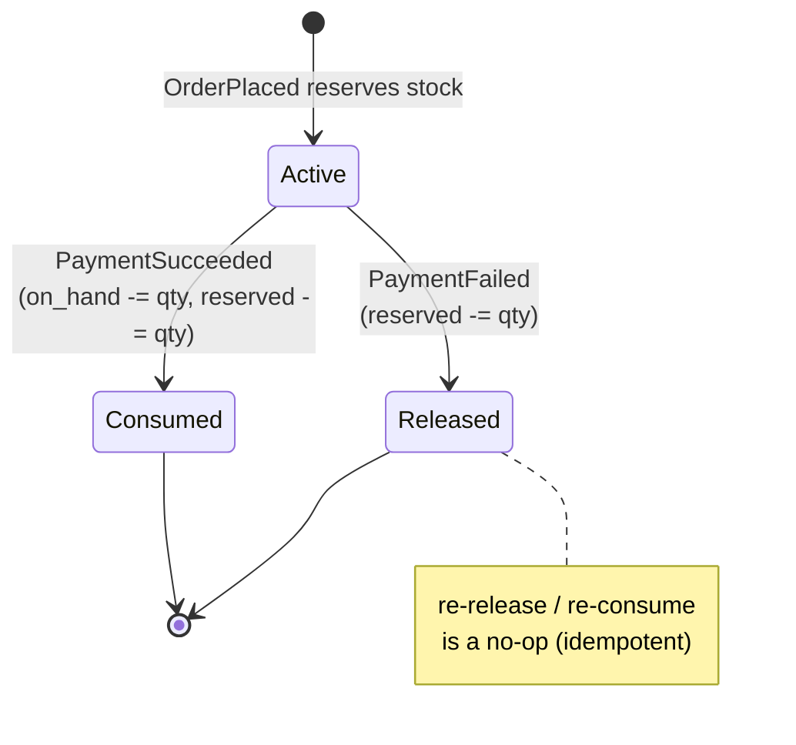
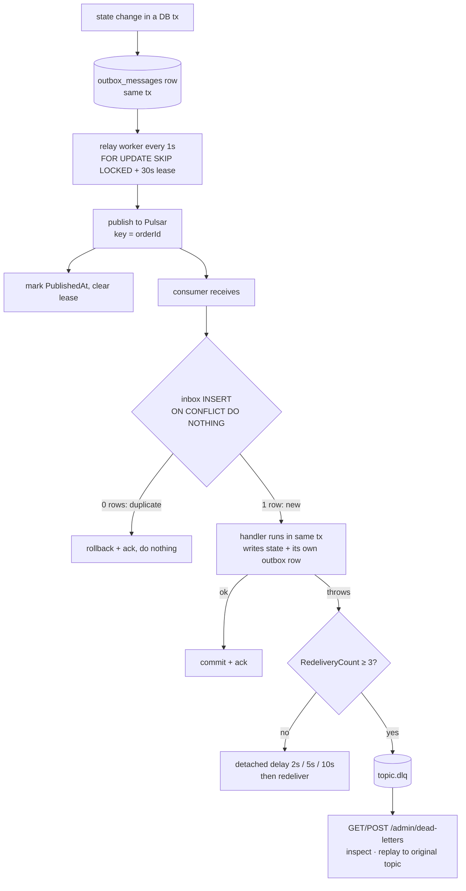
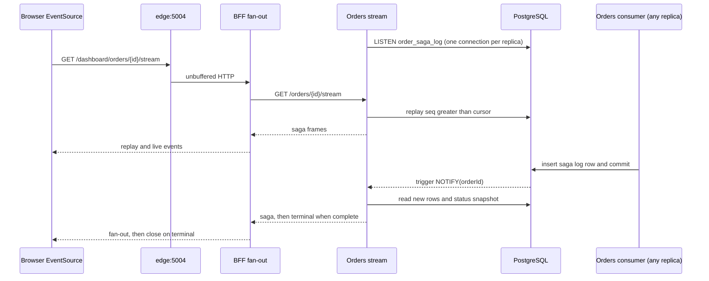

# OrderFlow — solution overview

What is actually implemented in this repository, how the distributed order flow works,
and where each concern lives in the code. Written to be read alongside the source, not
instead of it — every claim below points at a file.

The requirement is [Coding challenge - Order flow.md](Coding%20challenge%20-%20Order%20flow.md).
This document is the "what we built" answer to it.

---

## 1. At a glance

| Aspect | Choice |
| --- | --- |
| Runtime | .NET 10, C#, minimal APIs + `BackgroundService` workers |
| Services | 3 backend (`Orders`, `Inventory`, `Payments`) + 1 Blazor WebAssembly client |
| Datastore | PostgreSQL 16, **one database per service**, schema-per-service, no cross-DB access |
| Broker | Apache Pulsar 3.2 standalone; `KeyShared` subscriptions keyed by `orderId` |
| Saga style | **Choreographed** — no orchestrator; each service reacts to events and emits its own |
| Delivery guarantee | At-least-once + **inbox dedup** (idempotent consumers) |
| Publishing | **Transactional outbox** + per-service relay worker (`FOR UPDATE SKIP LOCKED` lease) |
| Poison messages | Backed-off redelivery, then **dead-letter topic after 3 attempts**, with inspect/replay endpoints |
| Runtime orchestration | Docker Compose; one-shot `*-migrator` services; single `edge` proxy owns host ports 5000–5004 |
| Client → API path | Browser talks only to the **BFF** (`src/Web/OrderFlow.Bff`, port 5004), which composes Orders + Inventory server-side (§2.5) |
| Stock consumption on success | **Reduce `quantity_on_hand`, clear the reservation's `quantity_reserved`, mark reservation `Consumed`** (see §5) |

Everything the challenge lists under "Requirements" is implemented. Known gaps are in §8.

---

## 1a. How the core requirement is handled — diagrams

> All diagrams are [Mermaid](https://mermaid.js.org/) and render on GitHub, in VS Code
> (Markdown Preview Mermaid), and most Markdown viewers.

### System context



Each service reads and writes **only its own database**. The browser's only origin is the BFF; the
BFF's calls to Orders/Inventory and the browser's `POST /orders` are the only synchronous hops —
every saga step travels as a Pulsar event. Ports 5001–5003 remain exposed for direct access
(tests, demo, `curl`).

### API Composition for the dashboard



Orders is required (its failure → `503`); Inventory is degradable (its failure → `stock: null` +
a warning, the rest of the dashboard still renders).

### The two required outcomes as one flowchart



### Happy path — sequence (total ≠ `*.99`)

```mermaid
sequenceDiagram
    autonumber
    actor C as Client
    participant O as Orders
    participant Bus as Pulsar
    participant I as Inventory
    participant P as Payments

    C->>O: POST /orders {lines}
    Note over O: tx: INSERT order + saga_state<br/>+ outbox(OrderPlaced)
    O-->>C: 202 Accepted {orderId}
    O->>Bus: OrderPlaced  (key = orderId)

    Bus->>I: OrderPlaced
    Note over I: tx: inbox(eventId)<br/>FOR UPDATE stock; reserved += qty<br/>INSERT reservations(Active)<br/>outbox(ReservationSucceeded)
    I->>Bus: ReservationSucceeded

    Bus->>O: ReservationSucceeded
    Note over O: status = Charging<br/>reservation_completed = true
    Bus->>P: ReservationSucceeded
    Note over P: tx: inbox(eventId)<br/>INSERT payment(Succeeded)<br/>outbox(PaymentSucceeded)
    P->>Bus: PaymentSucceeded

    Bus->>O: PaymentSucceeded
    Note over O: status = Confirmed<br/>payment_completed = true
    Bus->>I: PaymentSucceeded
    Note over I: tx: on_hand -= qty; reserved -= qty<br/>reservation = Consumed

    C->>O: GET /orders/{id}  →  Confirmed
```

### Failure path — sequence (total ends in `.99`, compensation)



### Order status machine (Orders service)



### Reservation status machine (Inventory service)



### One message through the reliability machinery



---

## 2. Services and ownership

Each backend service is a single ASP.NET Core project: `Api/` (HTTP surface), `Domain/Entities/`
(its model — note the namespace is currently `…Infrastructure.Persistence.Entities`, a folder/
namespace mismatch), `Infrastructure/`
(persistence, messaging, health, options, migrations). `Program.cs` wires options → `DbContext`
→ `PulsarEventBus` → hosted workers → health checks.

### 2.1 Orders — `src/Orders/OrderFlow.Orders.Api`, host port 5001

Source of truth for the saga's overall progress. Owns schema `orderflow_orders`:
`orders`, `order_lines`, `order_saga_state`, **`order_saga_log`**, `outbox_messages`, `inbox_messages`.

| HTTP | Handler |
| --- | --- |
| `POST /orders` | [OrdersEndpointExtensions.cs](../src/Orders/OrderFlow.Orders.Api/Api/OrdersEndpointExtensions.cs) — writes `orders` + `order_lines` + `order_saga_state` + an `OrderPlaced` outbox row in **one `SaveChanges`**, returns `202 Accepted` with `orderId == correlationId`. |
| `GET /orders/{id}` | Header, lines, `reservationCompleted` / `paymentCompleted`, and the **outcome**: `failureStage` (`ReservationRejected` \| `PaymentDeclined`), `failureReason`, `completedAt`. |
| `GET /orders/{id}/stream` | SSE replay and live saga rows, followed by terminal; backed by the PostgreSQL notification trigger. |
| `GET /orders/{id}/trace` | The ordered `order_saga_log` — every saga event Orders recorded, with `source`, `occurredAt`, and a small `detail` JSON (reason, amount, released lines). Drives the UI event feed. |
| `GET /orders?customerId=` | List; `customer_id` is indexed. |
| `GET /health/live` \| `/health/ready` \| `/health` | liveness (always cheap) / dependency readiness (DB + Pulsar). |
| `GET /admin/dead-letters` · `POST /admin/dead-letters/replay` | [DeadLetterEndpointExtensions.cs](../src/Orders/OrderFlow.Orders.Api/Api/DeadLetterEndpointExtensions.cs) |

**Consumers** (each a `BackgroundService`, base class [OrdersEventConsumer.cs](../src/Orders/OrderFlow.Orders.Api/Infrastructure/Messaging/OrdersEventConsumer.cs)):

| Event in | Class | Effect on the order |
| --- | --- | --- |
| `OrderPlaced` | `OrderPlacedConsumer` (subscription `orderflow.orders.status.v1`) | `Pending → Reserving` |
| `ReservationSucceeded` | `ReservationSucceededConsumer` | `→ Charging`, `saga.reservation_completed = true` |
| `ReservationFailed` | `ReservationFailedConsumer` | `→ Cancelled`, `failureStage = ReservationRejected`, `failureReason` from the event |
| `PaymentSucceeded` | `PaymentSucceededConsumer` | `→ Confirmed`, `saga.payment_completed = true`, `completedAt` set |
| `PaymentFailed` | `PaymentFailedConsumer` | `→ Cancelled`, `failureStage = PaymentDeclined`, `failureReason` from the event |
| `StockReleased` | `StockReleasedConsumer` | no status change — records the compensation step in `order_saga_log` |

The base `OrdersEventConsumer.HandleAsync` does inbox-dedup → load order → `Apply` → append one
`order_saga_log` row → save → commit, **all in one transaction**. The status rules themselves live
in [OrderSagaTransitions.cs](../src/Orders/OrderFlow.Orders.Api/Infrastructure/OrderSagaTransitions.cs)
— one guarded method per event, unit-tested in `Orders.Tests`.

Status enum: `Pending → Reserving → Charging → Confirmed`, with `Cancelled` reachable from
`Reserving` or `Charging` ([OrderStatus.cs](../src/Orders/OrderFlow.Orders.Api/Infrastructure/Persistence/Entities/OrderStatus.cs)).
Transitions are guarded — a terminal status is never overwritten, so a late/duplicate event can't
resurrect a cancelled order.

Orders publishes only `OrderPlaced`. It does **not** publish `OrderCancelled` today.

### 2.2 Inventory — `src/Inventory/OrderFlow.Inventory.Api`, host port 5002

Owns schema `orderflow_inventory`: `stock_items`, `reservations`, `outbox_messages`, `inbox_messages`.
Seeded with `WIDGET-01` (10 on hand) and `WIDGET-02` (5 on hand) via the initial migration
([InventoryDbContext.cs](../src/Inventory/OrderFlow.Inventory.Api/Infrastructure/Persistence/InventoryDbContext.cs)).

| HTTP | Handler |
| --- | --- |
| `GET /stock` | `sku`, `quantityOnHand`, `quantityReserved`, `available = onHand - reserved` |
| `POST /stock/{sku}/adjust` | Demo helper — sets on-hand; refuses to go below the currently-reserved amount |
| health + dead-letter endpoints | as Orders |

**Consumers** (base [InventoryEventConsumer.cs](../src/Inventory/OrderFlow.Inventory.Api/Infrastructure/Messaging/InventoryEventConsumer.cs), subscription `orderflow.inventory.saga.v1`):

| Event in | Class | Effect |
| --- | --- | --- |
| `OrderPlaced` | [OrderPlacedConsumer.cs](../src/Inventory/OrderFlow.Inventory.Api/Infrastructure/Messaging/OrderPlacedConsumer.cs) | For every line: `SELECT … FOR UPDATE` the `stock_items` row, check `onHand - reserved >= qty`. All lines fit → bump `quantity_reserved`, insert `reservations` rows (`Active`), emit `ReservationSucceeded`. Any line short → emit `ReservationFailed`, touch nothing. |
| `PaymentSucceeded` | `PaymentSucceededConsumer` | For each `Active` reservation of the order: `onHand -= qty`, `reserved -= qty`, reservation `→ Consumed`. |
| `PaymentFailed` | `PaymentFailedConsumer` | **Compensation**: for each `Active` reservation: `reserved -= qty`, reservation `→ Released`; emit `StockReleased`. |

Publishes `ReservationSucceeded`, `ReservationFailed`, `StockReleased`.

### 2.3 Payments — `src/Payments/OrderFlow.Payments.Api`, host port 5003

Owns schema `orderflow_payments`: `payments`, `outbox_messages`, `inbox_messages`.

| HTTP | Handler |
| --- | --- |
| `GET /payments/{orderId}` | `404` until a payment row exists, then `paymentId`, `amount`, `status`, `createdAt` |
| health + dead-letter endpoints | as Orders |

**Consumer**: [ReservationSucceededConsumer.cs](../src/Payments/OrderFlow.Payments.Api/Infrastructure/Messaging/ReservationSucceededConsumer.cs)
(subscription `orderflow.payments.saga.v1`) — on `ReservationSucceeded`, run the fake gateway,
write one `payments` row + one outbox row (`PaymentSucceeded` or `PaymentFailed`) in one transaction.

**Fake gateway** — `FakePaymentGateway : IPaymentGateway`
([IPaymentGateway.cs](../src/Payments/OrderFlow.Payments.Api/Infrastructure/Payments/IPaymentGateway.cs),
[FakePaymentGateway.cs](../src/Payments/OrderFlow.Payments.Api/Infrastructure/Payments/FakePaymentGateway.cs)):
`WouldDecline(amount) => round(amount % 1, 2) == 0.99m`. Any total whose cents are `.99` is
declined, deterministically; nothing else is. The consumer depends on the `IPaymentGateway`
interface (registered in DI) and maps the result to a payment row + event via the pure
`PaymentRecord.From(...)`.

### 2.4 Web — `src/Web/OrderFlow.Web`, host port 5000

Blazor WebAssembly, served as static files by nginx. `wwwroot/appsettings.json` now holds a
**single** URL — `ApiUrls:Bff` — no per-service addresses, no secrets, no connection strings.
`OrderFlowApiClient` is a thin typed client over that one origin.

- **Place order** (`PlaceOrder.razor`) submits a normal POST, then receives live saga events through one BFF EventSource. Status trail, timeline, outcome banner and event cards share that stream. Navigation disposes the subscription.
- **Dashboard** (`Dashboard.razor`) refreshes stock and recent orders with `GET /dashboard` every five seconds. Selecting an order loads its details once, then one EventSource updates its timeline, reason and journey.
- **SagaTimeline** ([SagaTimeline.razor](../src/Web/OrderFlow.Web/Components/SagaTimeline.razor)) — `Placed → Reserved → Charged → Confirmed/Cancelled` stepper; the failed step is coloured from the order's `failureStage`.
- **SagaJourney** (`SagaJourney.razor`) owns the tracked-order stream and renders one card per saga event. It forwards progress to the parent, deduplicates replay by sequence, and shows connection stalls. The shared `SagaStreamClient` falls back to a five-second composed tracked-order poll after repeated connection errors.

### 2.5 BFF — `src/Web/OrderFlow.Bff`, host port 5004

A stateless ASP.NET Core app that is the SPA's single origin and the **API Composer** for the
dashboard. It has **no database, no Pulsar client, no project reference into `src/`** — it owns
its own view models (`Bff/Contracts/`) and speaks only HTTP + JSON.

| Endpoint | Kind | What it does |
| --- | --- | --- |
| `GET /dashboard` | composed | Fans out to Orders `/orders` + Inventory `/stock` **in parallel** under one 3 s budget; returns `{ stock?, orders, warnings[], asOf }`. |
| `GET /dashboard/orders/{id}/stream` | streaming | One Orders upstream per locally tracked order, fan-out and memory replay, with stalled/reconnect handling. |
| `GET /dashboard/orders/{id}` | composed | Orders `/orders/{id}` + `/orders/{id}/trace` → `{ order, trace[] }`; `404` if Orders doesn't know the id. |
| `POST /orders` | pass-through | Forwards the create request to Orders, relays status + body verbatim. |
| `GET /orders/{id}`, `GET /orders/{id}/trace` | pass-through | Relay, so the SPA keeps one origin. |
| `GET /health/{live,ready}` | — | `ready` also pings both downstreams. |

Failure policy is per field: **Orders is required** (failure → `503`), **Inventory and the trace
are degradable** (failure → omitted + a `warnings[]` entry).
[DashboardComposer.cs](../src/Web/OrderFlow.Bff/Composition/DashboardComposer.cs) is the composer;
[Clients/](../src/Web/OrderFlow.Bff/Clients/) holds the typed downstream clients (each with
`PooledConnectionLifetime` + `AddStandardResilienceHandler`). What it does **not** do: participate
in the saga, hold state, or aggregate for any client other than this web UI.

---

## 3. The distributed order flow

Step-by-step message diagrams are in §1a. This section records the **net effect on state** for
each path — the thing a reviewer verifies.

### 3.1 Happy path (total ≠ `*.99`) — see the "Happy path" sequence in §1a

`quantity_on_hand` permanently drops by the ordered quantity; `quantity_reserved` returns to its
prior value; the reservation row is kept as `Consumed` for audit. Order ends `Confirmed`,
`payments` row `Succeeded`.

### 3.2 Failure path (total ends in `.99`) — see the "Failure path" sequence in §1a

`quantity_on_hand` unchanged, `quantity_reserved` back to its prior value — **stock is exactly
what it was before the order**. The reservation row survives as `Released`. Order ends
`Cancelled`, `payments` row `Failed`. `StockReleased` is published but has no consumer today.

### 3.3 Reservation-failure path (not enough stock)

`OrderPlaced` → Inventory can't satisfy a line → `ReservationFailed` → Orders `status=Cancelled`.
No stock was ever touched, so there is nothing to compensate. Payments never hears about the order.

---

## 4. Cross-cutting patterns (where they live)

### 4.1 Transactional outbox
Every event-producing state change writes an `outbox_messages` row in the **same
`SaveChangesAsync`** as the business rows — see `AddOutbox` in the consumer base classes and the
inline outbox insert in `OrdersEndpointExtensions.CreateOrderAsync`.

A per-service relay (`*OutboxPublisher : BackgroundService`, e.g.
[InventoryOutboxPublisher.cs](../src/Inventory/OrderFlow.Inventory.Api/Infrastructure/Messaging/InventoryOutboxPublisher.cs))
polls every second, claims one row with `... FOR UPDATE SKIP LOCKED` + a 30-second `LockExpiresAt`
lease, publishes to Pulsar, then stamps `PublishedAt`. The lease lets another replica recover a
row whose owner crashed mid-publish; a double-publish is harmless because the consumer dedups.

### 4.2 Inbox / idempotency
Every consumer's first step, inside its transaction:
`INSERT INTO inbox_messages (EventId) … ON CONFLICT DO NOTHING`. Zero rows inserted ⇒ already
processed ⇒ roll back and ack. Pulsar redelivery and outbox double-publish are both absorbed here.

### 4.3 Ordering per order
`PulsarEventBus.CreateConsumer` uses `SubscriptionType.KeyShared`; every publish sets
`.Key(orderId)` ([PulsarEventBus.cs](../src/BuildingBlocks/OrderFlow.Messaging/PulsarEventBus.cs)).
All events for one order land on one partition and one consumer instance, in order; different
orders spread across instances.

### 4.4 Concurrency on the last unit
`LockStockAsync` issues `SELECT * FROM stock_items WHERE Sku = … FOR UPDATE` inside the consumer
transaction; the quantity arithmetic + invariants that run under that lock are
[StockOperations.cs](../src/Inventory/OrderFlow.Inventory.Api/Infrastructure/StockOperations.cs).
Two `OrderPlaced` events for the same SKU serialize on the row lock; the second sees the first's
committed `quantity_reserved` and `StockOperations.CanReserve` returns false. Locks are taken in a
consistent `ORDER BY Sku` sequence, so concurrent multi-line orders can't deadlock.

Two test layers:
- **`StockOperationsTests`** — pure, no Docker: over-booking, release-more-than-reserved,
  consume-when-short, reserve↔release restores exact quantities, non-positive quantities rejected.
- **`StockReservationConcurrencyTests`** — Testcontainers PostgreSQL, `[SkippableFact]`: proves the
  *row lock* actually serialises (`ConcurrentReservationOnlyOneWins`, `WIDGET-01` seeded to 1),
  inbox `ON CONFLICT` dedup (`DuplicateEventIsIgnored`), and end-to-end compensation
  (`PaymentFailedRestoresStockExactly`). Skips — does not fail — when Docker is unreachable.

### 4.5 Retry, backoff, DLQ
[PulsarConsumerWorker.cs](../src/BuildingBlocks/OrderFlow.Messaging/PulsarConsumerWorker.cs):
handler throws → log with `OrderId`/`CorrelationId` scope → if `RedeliveryCount >= 3`, publish the
raw payload to `<topic>.dlq` and ack; otherwise schedule a **detached** delayed
`RedeliverUnacknowledgedMessages` (2 s / 5 s / 10 s, [RedeliveryPolicy.cs](../src/BuildingBlocks/OrderFlow.Messaging/Resilience/RedeliveryPolicy.cs)),
tracked so shutdown awaits it.

DLQ is not write-only: `PulsarEventBus.ReadDeadLettersAsync` (non-destructive peek subscription)
and `ReplayDeadLettersAsync` (acks as it re-publishes to the **original** topic) back the
`/admin/dead-letters` endpoints on every service.

### 4.6 Event contract
On the wire: [WireEvent.cs](../src/BuildingBlocks/OrderFlow.Messaging/WireEvent.cs) —
`EventType, EventId, CorrelationId, OrderId, Timestamp, Data (JSON), SchemaVersion=1`.
Consumers reject an unknown `SchemaVersion`. Payload records
([OrderPlaced.cs](../src/BuildingBlocks/OrderFlow.Contracts/OrderPlaced.cs) etc.) live in
`OrderFlow.Contracts` and carry **only** transport DTOs — no entities, no `DbContext`.

### 4.7 Observability
`Logging:Console:FormatterName = json` in `appsettings.Production.json` (Compose runs Production),
plus `logger.BeginScope` carrying `OrderId` / `CorrelationId` / `EventType` around every consume
and publish. One order's whole saga is:
`docker compose logs --no-color orders-api inventory-api payments-api | grep <orderId>`.

### 4.7a Saga trace read model
Orders keeps an append-only `order_saga_log` (one row per `(orderId, eventType)`, so it's
idempotent). Every Orders consumer writes its row **in the same transaction** as the status
change, via `OrdersEventConsumer.AppendSagaLogAsync`. `GET /orders/{id}/trace` returns the
ordered list; the Blazor `SagaJourney` component renders it as a live event feed. This is the
in-app equivalent of the `docker compose logs | grep` trace and needs no infrastructure.

### 4.8 Configuration & health
`DatabaseOptions` / `PulsarOptions` are bound with `.ValidateDataAnnotations().ValidateOnStart()`
plus a real `NpgsqlConnectionStringBuilder` parse and `pulsar://` / `http(s)://` scheme checks —
misconfiguration fails at boot, not at first use. `/health/live` (no dependency checks) vs
`/health/ready` (DB + Pulsar) is the standard liveness/readiness split; the Dockerfile
`HEALTHCHECK` and Compose `condition: service_healthy` both watch `/health/live`.

---

## 5. Stock-consumption choice (challenge §2.6)

**On `PaymentSucceeded` the Inventory service reduces `quantity_on_hand` by the reserved quantity,
reduces `quantity_reserved` by the same amount, and marks the reservation `Consumed`** — all in one
transaction ([PaymentSucceededConsumer.cs](../src/Inventory/OrderFlow.Inventory.Api/Infrastructure/Messaging/PaymentSucceededConsumer.cs)).

Why this and not "just mark the reservation Consumed":
- `available = quantity_on_hand - quantity_reserved` stays the single, obvious availability formula
  at every moment. A reviewer reading `stock_items` sees the truth without joining `reservations`.
- The `reservations` row is kept (status `Consumed`) as an audit trail of what happened to the hold.
- The invariant `quantity_on_hand >= 0` and `available >= 0` is easy to assert and is checked
  defensively before every decrement.

---

## 6. SOLID / design-principles mapping (concrete, not aspirational)

| Principle | Where it shows up |
| --- | --- |
| **Single responsibility** | One class per event handler (`OrderPlacedConsumer`, `PaymentFailedConsumer`, …), each doing exactly one saga step. Decisions are pulled into pure helpers — `OrderSagaTransitions` (order status rules), `StockOperations` (stock arithmetic), `OrderReservation` (all-or-nothing check), `PaymentRecord` (charge → event), `OrderValidation` (request rules), `PoisonMessagePolicy` — so a consumer just wires deserialize → decide → persist. `*OutboxPublisher` only relays. |
| **Dependency inversion (extra)** | Payments depends on `IPaymentGateway`, not the concrete fake — swap in a real provider without touching the saga; unit tests use a stub. |
| **Open/closed** | Adding a saga reaction = add a `*Consumer` subclass + register it in `Program.cs`; the `PulsarConsumerWorker` / `*EventConsumer` base classes (receive loop, inbox insert, transaction, DLQ) are not touched. New event type = new record in `OrderFlow.Contracts` + new topic constant. |
| **Liskov substitution** | Every consumer is a `BackgroundService` and every service-specific consumer is a drop-in `*EventConsumer`; the host treats them uniformly. `PulsarEventBus` is the only Pulsar abstraction and behaves identically for all callers. |
| **Interface segregation** | `OrderFlow.Contracts` exposes only wire DTOs; consumers depend on `PulsarEventBus` + their own `DbContext` and nothing else. No "god" service interface. HTTP models (`Api/Contracts/`) are separate from domain entities and from the Web client's models. |
| **Dependency inversion** | Handlers depend on `IServiceScopeFactory` / `DbContextOptions` / `IOptions<T>`, resolved by DI in `Program.cs`. Config is injected as validated options, never read ad hoc. The Web client depends on a typed `OrderFlowApiClient` registered through `IHttpClientFactory` with a resilience handler. |
| **Don't repeat yourself** | Outbox/inbox/transaction boilerplate lives once per service in the `*EventConsumer` base; the Pulsar receive/ack/retry/DLQ loop lives once in `PulsarConsumerWorker`; compiler posture lives once in `Directory.Build.props`; topic names live once in `PulsarTopics.cs`. |
| **Service autonomy / bounded context** | Physically enforced: separate database, separate Postgres container, separate schema, separate `DbContext`, no foreign keys or queries across services. Cross-service identifiers (`OrderId`, `Sku`) are stored as plain values. |
| **Fail fast** | Options `ValidateOnStart`; stock invariants checked before every decrement and throw (→ retry → DLQ) rather than silently corrupting; readiness probe gates traffic. |

---

## 7. How the pieces run together (Docker Compose)

```
pulsar (healthy)
  └─> pulsar-init            creates partitioned topics + .dlq topics, exits 0
orders-db / inventory-db / payments-db (healthy)
  └─> orders-migrator / inventory-migrator / payments-migrator   `--migrate`, exits 0
        └─> orders-api / inventory-api / payments-api  (healthy on /health/live)
              └─> bff  (healthy on /health/live; depends on orders-api + inventory-api)
web (static SPA via nginx)
edge (nginx)  binds host 5000→web, 5001→orders, 5002→inventory, 5003→payments, 5004→bff
```

- **Migrations run exactly once**, in the `*-migrator` one-shot containers — API replicas never
  call `Database.Migrate()`, so scaling `--scale orders-api=3` is race-free.
- **Only `edge` publishes host ports.** Backend containers expose only their internal `8080`, so
  replicas don't collide; nginx resolves the scaled service name via Docker DNS.
- **The BFF is stateless**, so `--scale bff=3` needs no coordination — `edge` round-robins to the
  replicas, and each replica re-resolves Docker DNS for its downstream calls
  (`PooledConnectionLifetime`) so they spread across scaled Orders/Inventory replicas too.
- `docker-compose.prod.yml` is an overlay that makes every `*_DB_PASSWORD` mandatory (no dev
  default) and sets real resource limits — the "local vs deploy" delta in one file.

---

## 8. Known limitations

The known trade-offs below are all acceptable for the challenge scope:

| # | Limitation | Impact |
| --- | --- | --- |
| ~~1~~ | ~~Failure reason discarded~~ | **Fixed** — `failureStage` + `failureReason` on the order, shown in API + UI. |
| ~~2~~ | ~~No per-order event trace~~ | **Fixed** — `order_saga_log` + `GET /orders/{id}/trace` + `SagaJourney` feed. |
| 3 | SSE fan-out history is per BFF replica; connections have a ten-minute cap. | Duplicate upstreams across replicas are accepted; browsers reconnect and replay automatically. |
| 4 | Redelivery is detached (no longer blocks the loop) but still one consumer per subscription per instance; sustained failures on one order add latency to others on that instance. | Minor under demo load. |
| 5 | `OrderCancelled` is never published; `M3` create is not idempotent; `M5` status subscription kept on purpose. | None for the challenge scope. |
| 6 | `ReservationSucceeded.ReservationId` is a fresh random GUID, unrelated to the `reservations` rows. Nobody consumes it. | Misleading payload field; harmless. |
| 7 | Processed `inbox_messages` / `outbox_messages` / `order_saga_log` rows are never pruned. | Unbounded growth over a long-lived deployment; irrelevant for a demo. |
| 8 | Full `docker compose up` + browser smoke test requires a Docker host. | Reviewer verification step. |
| 9 | The BFF composes with **API Composition** (read-time fan-out), not a CQRS read model. | Availability = all queried services up; joins are in-memory. Acceptable at this scale; a read model is the next step if query load grows. |
| 10 | The BFF's circuit breaker is **per `HttpClient`**, not per replica; the optional stock cache would be **per BFF instance**. | An open breaker sheds load from all replicas of that downstream; cached stock can differ by a second between BFF replicas. |

---

## 9. Verification status

- `dotnet build OrderFlow.sln -c Release`: passes with zero warnings.
- `dotnet test --filter "Category!=Integration"`: 84 passing tests, Docker-free.
- `node --test tests/Web.Tests/sse.test.mjs`: three passing interop lifecycle tests.
- `SagaNotificationTests`: real PostgreSQL migration, LISTEN notification, and hub delivery
  pass from a Docker-connected SDK container. This test skips when Docker is unavailable.
- `ComposeSseTests`: happy/declined streams, replay via direct Orders and BFF, terminal
  closure, and HTTP error cases pass against a stack scaled to three BFF and Orders replicas.
- Six concurrent viewers stayed connected beyond 30 seconds, received `stalled` on an Orders
  outage, and resumed without duplicate or missing events before terminal cancellation.
- Existing Compose saga and BFF integration tests also pass. Headless Edge rendered the success
  banner and three event cards from one stream, with no trace polling or browser exceptions.
- `nginx -t`: passes. PostgreSQL `max_connections` is 100 at this demo scale.
## Live saga feed: Orders producer and BFF fan-out

Orders exposes `GET /orders/{id}/stream` alongside `/trace`. Both use the same `SagaRow`
projection. A hand-written migration installs `orderflow_orders.notify_saga_log()` and its
AFTER INSERT trigger, using the existing quoted `"OrderId"` column. PostgreSQL sends only an
order ID after commit; each replica's listener wakes subscribers to read durable rows.

The BFF exposes `GET /dashboard/orders/{id}/stream`, sharing one upstream for each locally
tracked order and replaying session history to late subscribers. Frames remain domain-opaque.
No new service, table, broker bridge, or contract-package dependency is introduced.



The dashboard's stock/orders tables refresh every five seconds; selected-order progress is
streamed. A payment decline shows `Compensating` until `StockReleased` arrives, then the
terminal cancellation banner. Stopping Payments delays progress while heartbeats continue;
losing the upstream Orders connection emits `stalled` and triggers BFF reconnect with backoff.

Both stream endpoints have a ten-minute cap and 15-second heartbeats. A notification outage
is repaired by periodic replay and listener reconnect. Fan-out memory and upstream connections
are per replica and released when the last local subscriber leaves; duplicate upstreams across
BFF replicas are accepted. Each Orders replica adds one dedicated PostgreSQL connection.
